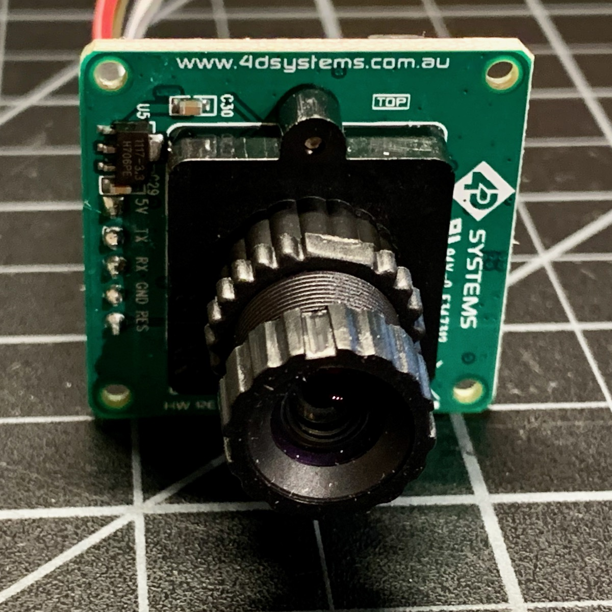
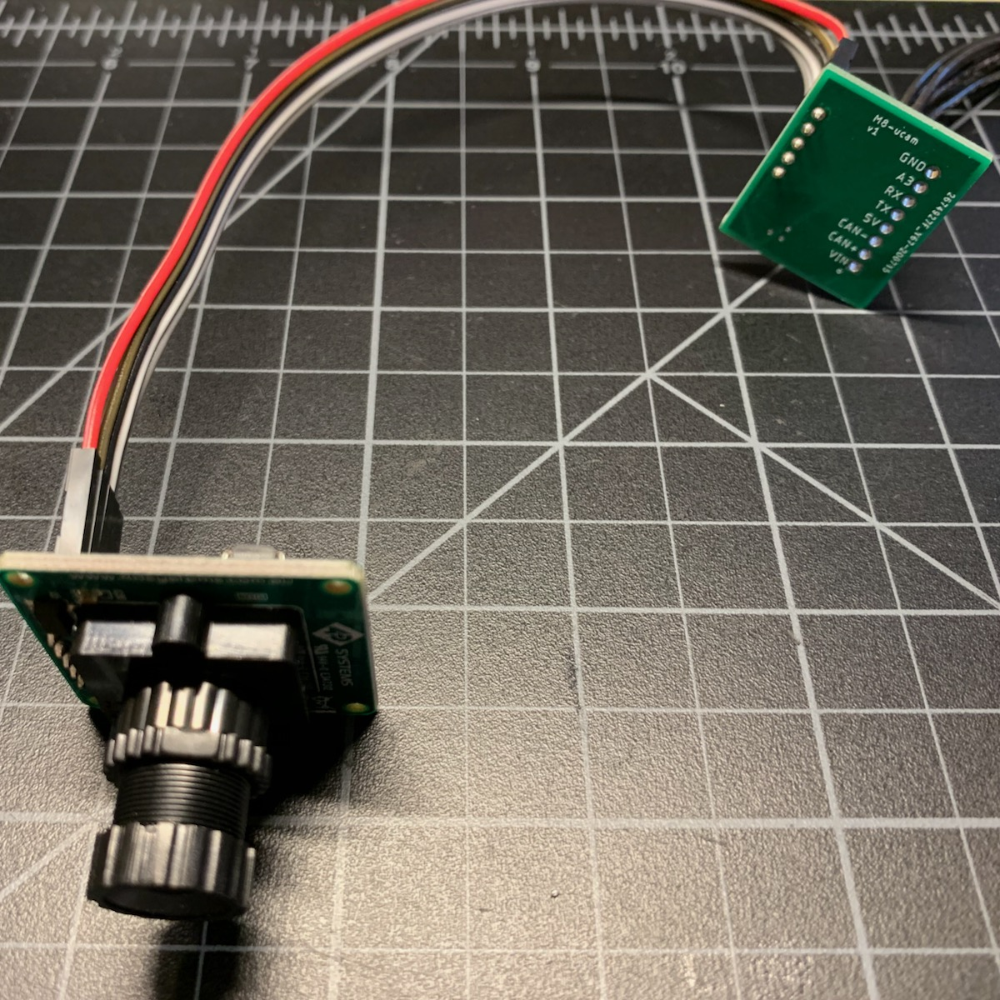
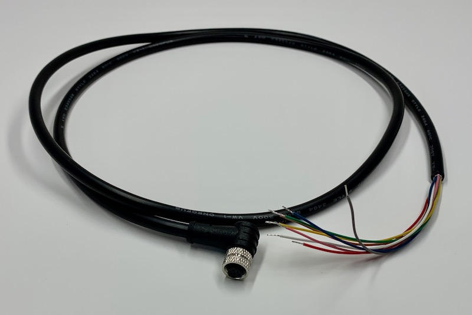
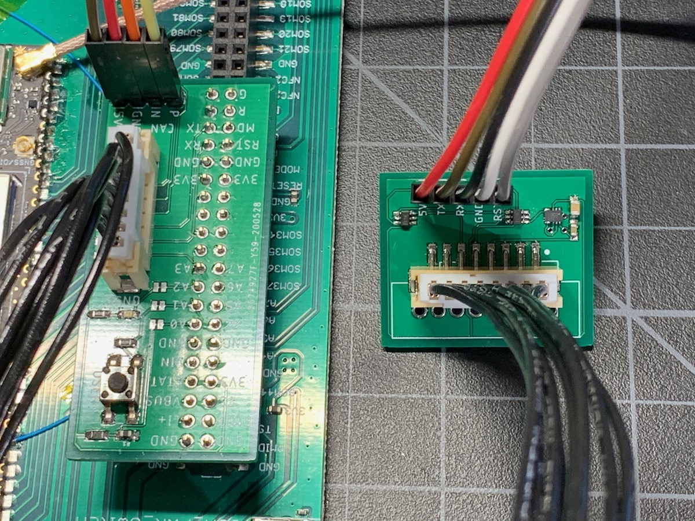
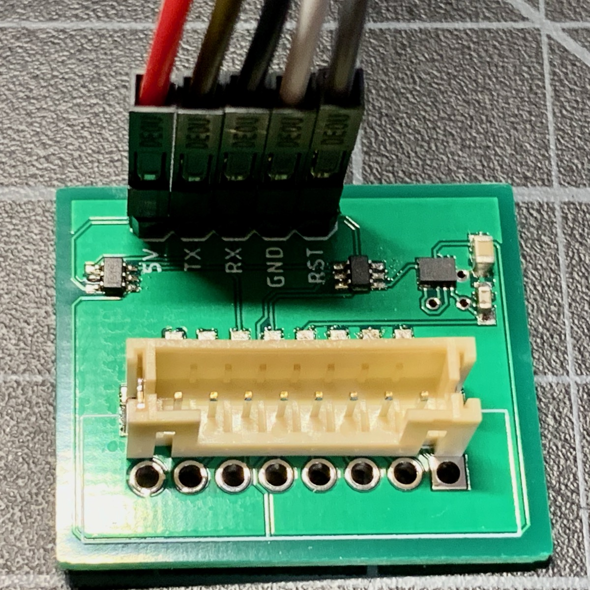
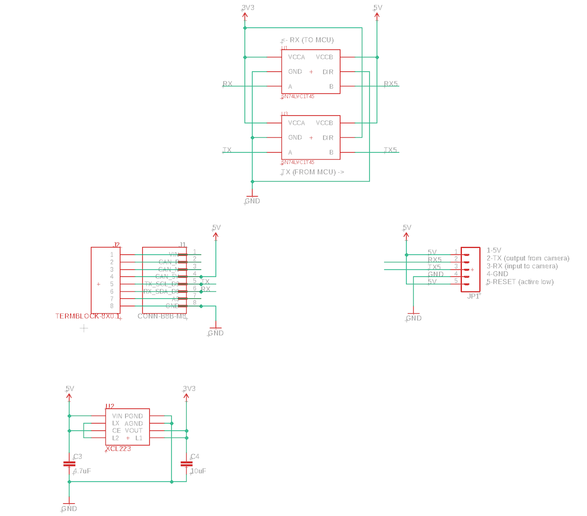
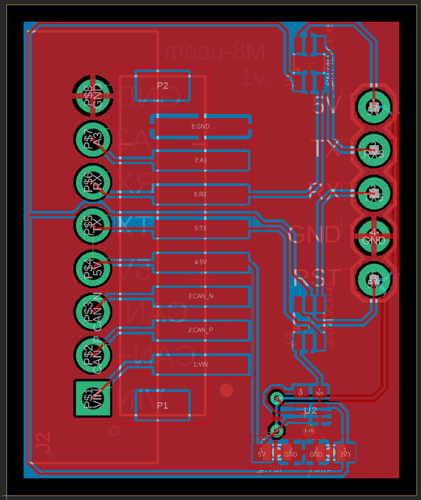
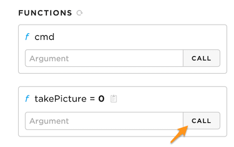

# Tracker One Camera

This tutorial shows how to add a [4D Systems uCam-III](https://4dsystems.com.au/ucam-iii) to a Particle Tracker One to take pictures and upload them.

The caveat to this is that there is no built-in service for capturing or storing these image files in the cloud yet, but there's a simple demonstration server written in node.js that saves the files to disk. You can securely run this server even on a network using NAT (network address translation) without firewall changes. But the server is not intended to be used in production deployments. It's just an illustration of what is possible.

## The Process

While the camera may seem expensive, the reason for this specific camera is that it does JPEG compression in hardware. There is a serial interface to the MCU and a protocol for downloading the compressed image file. This eliminates the need to buffer the image in RAM to compress it. Since Particle devices generally have less than 80 Kbytes of free RAM, it's not possible to do compression of raw images on the MCU.



The camera connects to a small interface board which connects to the M8 connector on the Tracker One.




The image files are downloaded to the flash file system (LittleFS) on the Tracker for uploading when possible. This allows many images to be buffered even when there is currently no cellular signal.

When the Particle cloud is reachable, the image file is uploaded. The binary JPEG file is broken up into 423 byte chunks. Each of the chunks is Base64 encoded and published using the `NO_ACK` mode for speed and to minimize the data used by the ACKs. After the transmission is completed, the server sends either a done message, or a request to retransmit missing chunks. This repeats until all of the chunks have been received.

The image is verified using a SHA1 hash to make sure it was successfully received, and if so a message is sent from the server to tell the Tracker to delete the image. 

If you reboot the Tracker, it will upload any unsent files.

It takes about 25 seconds to upload a 320x240 pixel image. The image is only about 10 Kbytes, but the data usage is more than that because of the Base64 encoding needed to transport it in an event, and overhead.

It takes about 50 seconds to upload a 640x480 pixel image. 

## Connecting

The M8 (8mm) 8-pin connector on the Tracker One is standard, however it's not common. Some other connectors like M12 are more common, however, the 12mm connector would have required a taller enclosure to fit the larger connector. To simplify designs, Particle will provide a M8 female-to-wires cable, similar to this. This is for illustration only and the design may vary in the future.



The common use case will be to include a cable gland in your expansion enclosure, pass the wires through the gland, and terminate them on your custom expansion board.

You'd typically connect those wires to your custom expansion board using one of several methods:

- Terminate with pins in a PHR-8 to mate with a B8B-PH on your expansion board
- Terminate with screw terminals on your board
- Terminate by soldering the wires to your board

This example design is intended to be a prototype for illustration purposes only. It includes the same B8B-PH connector that is inside the Tracker One on the Tracker Carrier board. This connector is inexpensive and can be attached to the Tracker One Carrier Board or an eval adapter using an easy-to-build PHR-8 to PHR-8 cable:



If you are interested in prototyping designs intended to connect to the Tracker One M8 connector, but want to do it using the Tracker SoM Evaluation Board, you may be interested in [this project](https://github.com/rickkas7/M8-Eval-Adapter). It's only a set of design files, BoM, etc. and you'd need to fabricate the board and build it yourself; it's not available as a finished product. It also explains a bit more about how the M8 connector can be used.


## Hardware

There is a small board use to connect the Tracker One M8 connector to the camera. The board includes:

- Connector for connect to the M8 connector using screw terminals, a PHR-8 cable, or soldered wires.
- A XCL224 3.3V regulator
- Level shifters to convert the 5V camera UART signals to 3.3V needed by the Tracker One.
- A 5-pin camera connector



### Schematic




### Board Layout



### BoM

| Quantity | Part | Description | Example | Cost |
| :---: | :--- | :--- | :--- | ---: |
| 1 | C3 | Capacitor Ceramic 4.7uF 6.3V 0603 | [Murata GRM188R60J475KE19J](https://www.digikey.com/product-detail/en/murata-electronics-north-america/GRM188R60J475KE19J/490-6407-1-ND/3845604) | |
| 1 | C4 | Capacitor Ceramic 10uF 16V 0805 | [Murata GRM21BR61C106KE15L](https://www.digikey.com/product-detail/en/murata-electronics-north-america/GRM21BR61C106KE15L/490-3886-1-ND/965928) | |
| 1 | U2 | XCL224 3.3V regulator | [Torex XCL224A333D2-G](https://www.digikey.com/product-detail/en/torex-semiconductor-ltd/XCL224A333D2-G/893-1419-1-ND/8256121) |$ 2.43| 
| 2 | U1, U3 | IC TRNSLTR BIDIRECTIONAL SC70-6 | [TI SN74LVC1T45QDCKRQ1](https://www.digikey.com/product-detail/en/texas-instruments/SN74LVC1T45QDCKRQ1/296-39212-1-ND/5143211) | $0.60 |
|   | JP1 | Male Header Pins (8x0.1") | [Sullins PRPC040SAAN-RC](https://www.digikey.com/product-detail/en/PRPC040SAAN-RC/S1011EC-40-ND/2775214) | |

Choose one of:

| Quantity | Part | Description | Example | Cost | 
| :---: | :--- | :--- | :--- | ---: | 
| 1 | J1 | Conn SMD 8 position 2.00mm | [JST B8B-PH-SM4-TB(LF)(SN)](https://www.digikey.com/product-detail/en/jst-sales-america-inc/B8B-PH-SM4-TB-LF-SN/455-1740-1-ND/926837) | $1.00 |
|   | J2 | Male Header Pins (8x0.1") | [Sullins PRPC040SAAN-RC](https://www.digikey.com/product-detail/en/PRPC040SAAN-RC/S1011EC-40-ND/2775214) | |
| 1 | J2 | Screw Terminal Block 8x0.1" PTH | [On Shore OSTVN08A150](https://www.digikey.com/product-detail/en/on-shore-technology-inc/OSTVN08A150/ED10566-ND/1588868) | $2.36 | 


## Firmware

### Getting the Tracker Edge Firmware

The Tracker Edge firmware can be downloaded from Github:

[https://github.com/particle-iot/tracker-edge](https://github.com/particle-iot/tracker-edge)

After downloading the source, you will need to fetch the library dependencies. This can be done from a command prompt or terminal window with the git command line tools installed:

```
cd tracker-edge
git submodule init
git submodule update --recursive
```

Be sure to target 1.5.4-rc.1 or later for your build. Device OS 1.5.3 or later is required, only version 1.5.4-rc.1 and later are available in the full set of tools including Workbench, CLI, and Web IDE.

### Add the libraries

From the command palette in Workbench, **Particle: Install Library** then enter **CameraHelperRK**. 

If you prefer to edit project.properties directly, add these:

```
dependencies.CameraHelperRK=0.0.1
```

This library includes two other libraries, **uCamIII** to handle interacting with the camera and **Base64RK** to do the Base64 encoding.

### The full source

The firmware is pretty self-explanatory. There is a copy in source/main.cpp as well.

```cpp
#include "Particle.h"

#include "tracker_config.h"
#include "tracker.h"

#include "CameraHelperRK.h"


SYSTEM_THREAD(ENABLED);
SYSTEM_MODE(SEMI_AUTOMATIC);

PRODUCT_ID(TRACKER_PRODUCT_ID);
PRODUCT_VERSION(TRACKER_PRODUCT_VERSION);

SerialLogHandler logHandler(115200, LOG_LEVEL_INFO, {
    { "app.gps.nmea", LOG_LEVEL_INFO },
    { "app.gps.ubx",  LOG_LEVEL_INFO },
    { "ncp.at", LOG_LEVEL_INFO },
    { "net.ppp.client", LOG_LEVEL_INFO },
    { "app.cam", LOG_LEVEL_TRACE },
});

int takePictureHandler(String cmd);

CameraHelperTracker cameraHelper(Serial1, 115200);


void setup()
{
    Tracker::instance().init();

    Particle.function("takePicture", takePictureHandler);

    // Enable cloud configuration of settings    
    // cameraHelper.setupCloudConfig();

    // Start the camera interface
    // The CameraHelperTracker turns on the CAN_PWR to power the camera.
    cameraHelper.setup();

    Particle.connect();
}

void loop()
{
    Tracker::instance().loop();

    cameraHelper.loop();
}

int takePictureHandler(String cmd) 
{
    // Take a picture
    cameraHelper.takePicture();

    // Send the current location
    TrackerLocation::instance().triggerLocPub();
    return 0;
}

```

It registers a function so you can easy trigger taking a picture from the console.

```cpp
Particle.function("takePicture", takePictureHandler);
```



Of course you can easily do it from code as well:

```cpp
// Take a picture
cameraHelper.takePicture();
```

## Server

The server code is in the server directory. 

- Install the node dependencies:

```bash
npm install
```

- Get an [access token](https://docs.particle.io/reference/developer-tools/cli/#particle-token-create)

- Set it as an environment variable:

```bash
export AUTH_TOKEN=xxxxxxx
```

- Run the server. Be sure to specify the productId of your Tracker product!

```bash
node app.js --productId 1234
```

The server creates a directory `data`. Within that directory will be a directory each device ID that is publishing to the product.

When a picture is uploaded, the JPEG file is reconstituted and verified, and if the SHA1 hash matches, it's saved in the device directory with a timestamp as a filename. The most recent `loc` event for the same device is also saved as a .json file so you can get the matching location information.


### Cloud Configuration

If you uncomment the `setupCloudConfig()` call in main.cpp, you can configure the image parameters from the cloud!

```cpp
// Enable cloud configuration of settings    
// cameraHelper.setupCloudConfig();
```

The cloud configuration cannot be set from the console, but you can set it from the CLI using curl. 

```bash
curl -X PUT https://api.particle.io/v1/products/:productId/config/:deviceId?access_token=:accessToken -H "Content-Type: application/json" -d "{\"ucam\":{\"resolution\":5,\"contrast\":2,\"brightness\":2,\"exposure\":2}}"
```

Be sure to update:

`:productId` with your product ID
`:deviceId` with your Device ID that is set as a development device. If you want to change the contrast across your whole product leave off the slash and device ID.
`:accessToken` with a product access token. An easy way to get a temporary 

One easy way to get a temporary access token is to:

- Open the [console](https://console.particle.io).
- Open your Tracker product.
- Click on **Devices**.
- Open your device.
- In the **Events** tab, click on **View events from a terminal** (it's a button).
- Copy and paste the access token from the end of the command that is displayed.
- This token is invalidated when your close the console.

The parameters are:

- resolution:

  One of:
  - 1 80x60
  - 2 160x120
  - 3 160x128
  - 5 320x240 (default)
  - 7 640x480
  - 8 128x96
  - 9 128x128

- contrast:

  One of: 
  - 0 minimum
  - 1 low
  - 2 default
  - 3 high
  - 4 max

- brightness:

  One of: 
  - 0 minimum
  - 1 low
  - 2 default
  - 3 high
  - 4 max

- exposure:

  One of:
  - 0 exposure -2
  - 1 exposure -1
  - 2 exposure 0 (default)
  - 3 exposure +1
  - 4 exposure +2
  


